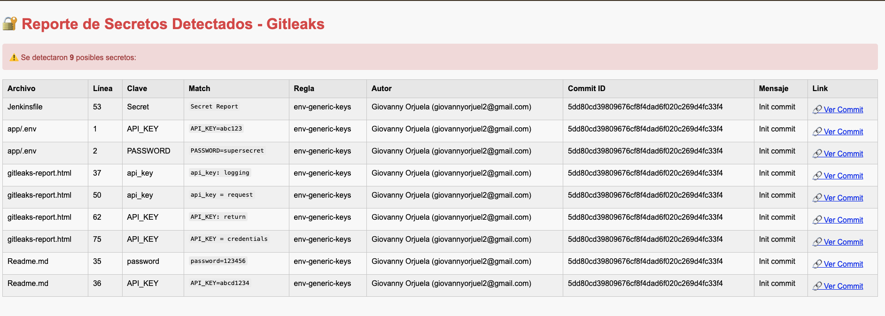

# 🔐 Gitleaks: Detecta secretos antes de que sea demasiado tarde


Publicación en Medium Tech & DevSecOps
https://medium.com/@giovannyorjuel2/stop-secret-leaks-before-they-happen-mastering-gitleaks-for-devsecops-pipelines-633d0f975162


⸻

## 🧱 Estructura del Proyecto

```bash
.
├── app/
│   ├── app.py
│   └── .env
├── .gitleaks.toml
├── gitleaks-report.json
├── gitleaks-report.html
└── generar_html_gitleaks.py
```


### 🚨 ¿Qué es Gitleaks y por qué importa?

Vivimos en una era donde cada segundo cuenta en la protección de datos. Cometer un error como subir una clave de acceso, una API Key, o un secreto en texto plano a un repositorio puede ser el primer paso hacia una brecha de seguridad crítica.

Aquí es donde entra Gitleaks: una poderosa herramienta de código abierto desarrollada para detectar secretos sensibles en tu código fuente, ya sea en proyectos personales, pipelines CI/CD o entornos empresariales.

⸻

🧠 ¿Cómo funciona Gitleaks?

Gitleaks escanea archivos y commits en repositorios Git (¡también puede escanear directorios fuera de Git!) usando una serie de reglas personalizables que buscan patrones comunes de secretos, como:
	•	Contraseñas (password=123456)
	•	Claves de API (API_KEY=abcd1234)
	•	Tokens de acceso (Bearer eyJhbGciOi...)
	•	Secretos de AWS, Azure, GCP
	•	y más…

Además, puede ser configurado con reglas propias (vía .gitleaks.toml) y se integra de forma sencilla en pipelines como Jenkins, GitHub Actions, GitLab CI, CircleCI, etc.

⸻

🧪 ¿Por qué deberías usarlo?
	•	✅ Prevención proactiva: Detecta antes de que un secreto se filtre públicamente.
	•	🔐 Mejora tu postura de seguridad: Identifica malas prácticas antes de que escalen.
	•	🧰 Automatización CI/CD: Puedes bloquear builds si se detectan secretos.
	•	🧩 Customizable: Define tus propias reglas para adaptarse a tu entorno.

⸻

### 🚀 Cómo empezar (rápido y en Docker)

``` bash
docker run --rm -v $(pwd):/repo zricethezav/gitleaks:latest detect \
  --no-git \
  --source=/repo/app \
  --report-format=json \
  --report-path=/repo/gitleaks-report.json \
  --config=/repo/.gitleaks.toml
```


### 🧩 El .gitleaks.toml: tus reglas, tu control
Este archivo define qué patrones se buscan. Puedes escanear tanto secretos comunes como personalizados:

``` toml
[[rules]]
description = "Generic API Key"
id = "generic-api-key"
regex = '''(?i)(api[_-]?key|secret|password)[\\s:=]+[^\s]+'''
tags = ["key", "custom", "env"]
```

## DEMO
``` sh
➜  Gitleaks git:(trunk) ✗ docker run --rm -v $(pwd):/repo zricethezav/gitleaks:latest detect \
  --source=/repo/app \
  --report-format=json \
  --report-path=/repo/gitleaks-report.json \
  --config=/repo/.gitleaks.toml

    ○
    │╲
    │ ○
    ○ ░
    ░    gitleaks

9:40PM INF 1 commits scanned.
9:40PM INF scanned ~13046 bytes (13.05 KB) in 76.5ms
9:40PM WRN leaks found: 9
```

Se Crea un archivo en json con todos los datos del secreto detectado.

``` json


[
 {
  "RuleID": "env-generic-keys",
  "Description": "Detect generic env-style secrets",
  "StartLine": 53,
  "EndLine": 53,
  "StartColumn": 44,
  "EndColumn": 56,
  "Match": "Secret Report",
  "Secret": "Secret",
  "File": "Jenkinsfile",
  "SymlinkFile": "",
  "Commit": "5dd80cd39809676cf8f4dad6f020c269d4fc33f4",
  "Link": "https://github.com/Poswark/Gitleaks/blob/5dd80cd39809676cf8f4dad6f020c269d4fc33f4/Jenkinsfile#L53",
  "Entropy": 2.251629,
  "Author": "Giovanny Orjuela",
  "Email": "giovannyorjuel2@gmail.com",
  "Date": "2025-07-13T21:30:34Z",
  "Message": "Init commit",
  "Tags": [
   "key",
   "env",
   "custom"
  ],
  "Fingerprint": "5dd80cd39809676cf8f4dad6f020c269d4fc33f4:Jenkinsfile:env-generic-keys:53"
 }

```

Si lo queremos ver en HTML

➜  Gitleaks git:(trunk) ✗ python3 generar_reporte_gitleaks.py 
✅ Reporte generado: gitleaks-report.html


